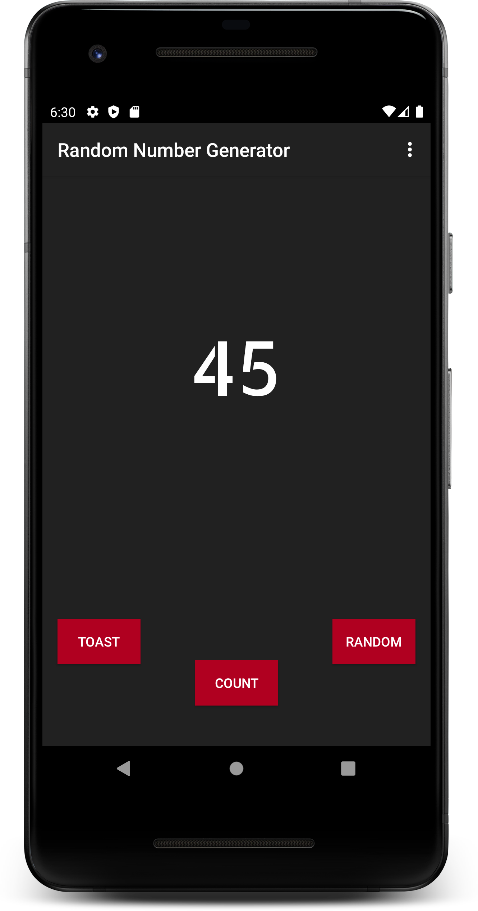
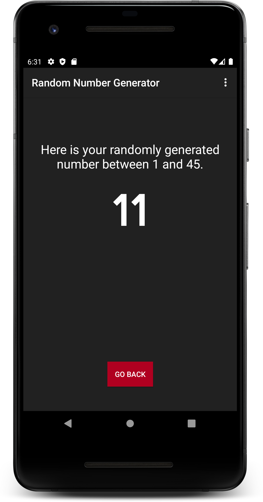

# RandomNumberGeneratorApp-android

This is my first android application. A very simple application that will allow to choose a limit and thereby will generate a random number between 1 and your chosen number. You can also go backwards and choose again if you want to.
Just Keep clicking the Count Button till you reach to your desired number and then click Random to generate a number.
Also as this is my first android application, I've also added a button which will simply display a Toast Message. This toast message is just for my understanding of how to add it in your application.

The minimum API Level of the app is 15 which means that only AVDs or Android Devices with API Level 15 or above or Android Version 4.0.3 or above will support the app. 

Feel free to give me ideas about new types of applications which will help me understand Android Development in a better and deeper way.

&ensp; &ensp; 
